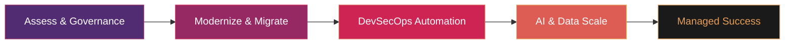

# Devopstrio

### Enterprise Cloud · AI · DevOps Acceleration

> **Building the future of enterprise infrastructure — one blueprint at a time.**  
> 18 open-source accelerators · 5 technology domains · 3 cloud providers · 100% production-grade

---

## 🏗️ Our Transformation Methodology

We don't just build infrastructure; we engineer **Landing Zones** that act as the launchpad for your entire digital ecosystem.

---

## 🌐 Our Services

Visit **[devopstrio.co.uk](https://devopstrio.co.uk/)** to explore all offerings. Here's a snapshot:

| Service | Description | Link |
| :--- | :--- | :--- |
| ☁️ **Enterprise Landing Zone** | CAF-aligned multi-cloud governance foundations with policy-as-code and subscription vending | [Explore →](https://devopstrio.co.uk/#services) |
| 🤖 **AI Landing Zone** | GenAI-ready secure OpenAI, Bedrock & Vertex AI deployment with enterprise RAG pipelines | [Explore →](https://devopstrio.co.uk/#services) |
| 📊 **Data Landing Zone** | Lakehouse architectures with Microsoft Fabric, Databricks & Snowflake for real-time analytics | [Explore →](https://devopstrio.co.uk/#services) |
| 🔐 **Security & Compliance** | Zero Trust architecture, IAM blueprints & Defender suite automation aligned to CIS and NIST | [Explore →](https://devopstrio.co.uk/#services) |
| ⚙️ **DevOps Acceleration** | Opinionated DevOps accelerators with Azure DevOps, GitHub Actions templates & platform engineering | [Explore →](https://devopstrio.co.uk/#repos) |

---

## ☁️ Multicloud Excellence (Azure | AWS | GCP)

We provide Cloud-Native solutions aligned with the highest industry standards (CAF & Well-Architected):

- 🟦 **Azure**: Enterprise Landing Zones (ALZ), AKS Hub-Spoke, and Microsoft Fabric Foundations.
- 🟧 **AWS**: Control Tower customization, EKS Blueprints, and Serverless architectures.
- 🟩 **GCP**: Anthos modernization and secure GKE foundations.

---

## 🤖 GenAI Ready (LLM, RAG & MLOps)

We bridge the gap between "Cool Demos" and "Production AI". Our **Secure AI Landing Zone** ensures your data stays within your perimeter.

- **Private OpenAI**: Deployment via Private Link and VNet integration.
- **Secure RAG**: High-performance Retrieval-Augmented Generation with Vector DB isolation.
- **Governance**: AI-specific guardrails and cost monitoring.

---

## 🔐 Security & DevSecOps Strategy

Security is not a checkbox; it's our foundation. Our **Zero-Trust** approach includes:

- **Shift-Left Security**: Secret scanning, SAST, and DAST integrated into [GitHub Actions](https://github.com/Devopstrio/devsecops-pipeline-templates).
- **Policy-as-Code**: Automated compliance via Azure Policy, AWS Config, and OPA.
- **Identity First**: Conditional Access and RBAC-based security models.

---

## 🛠️ Flagship Open-Source Accelerators

| Domain | Repository | Value Proposition |
| :--- | :--- | :--- |
| **Strategy** | [devopstrio-landing-zone](https://github.com/Devopstrio/devopstrio-landing-zone) | The blueprint for global enterprise scale. |
| **Networking** | [terraform-enterprise-networking](https://github.com/Devopstrio/terraform-enterprise-networking) | Multi-vNet connectivity with centralized security. |
| **AI** | [azure-openai-secure-reference](https://github.com/Devopstrio/azure-openai-secure-reference) | Privacy-first LLM infrastructure. |
| **Kubernetes** | [aks-production-foundation](https://github.com/Devopstrio/aks-production-foundation) | Production-ready Kubernetes orchestration. |
| **FinOps** | [cloud-finops-dashboard](https://github.com/Devopstrio/cloud-finops-dashboard) | Automated cloud cost transparency. |
| **Security** | [security-baselines](https://github.com/Devopstrio/security-baselines) | CIS & NIST-aligned automated remediation. |
| **Data** | [data-lakehouse-blueprint](https://github.com/Devopstrio/data-lakehouse-blueprint) | Medallion architecture on Microsoft Fabric & Databricks. |

---

## 🤝 Technology Partners & Ecosystem

| Partner | Specialization |
| :--- | :--- |
| **Microsoft Azure** | Enterprise Cloud, AI, and Governance |
| **GitHub** | Advanced workflow orchestration & DevOps |
| **HashiCorp** | Enterprise-grade Terraform and Vault modules |
| **Databricks** | Unified data analytics and AI platforms |
| **Snyk / Trivy** | Deep security scanning for containers and code |

---

## 📫 Connect With Our Architects

| Channel | Link |
| :---: | :---: |
| 🌐 **Website** | [devopstrio.co.uk](https://devopstrio.co.uk/) |
| 📋 **Services** | [devopstrio.co.uk/#services](https://devopstrio.co.uk/#services) |
| 🗂️ **Repositories** | [devopstrio.co.uk/#repos](https://devopstrio.co.uk/#repos) |
| 💼 **LinkedIn** | [linkedin.com/company/devopstrioglobal](https://www.linkedin.com/company/devopstrioglobal/) |
| 📧 **Email** | [info@devopstrioglobal.com](mailto:info@devopstrioglobal.com) |

---

⭐ **Follow Devopstrio** to get notified about our latest open-source accelerators and enterprise blueprints.

