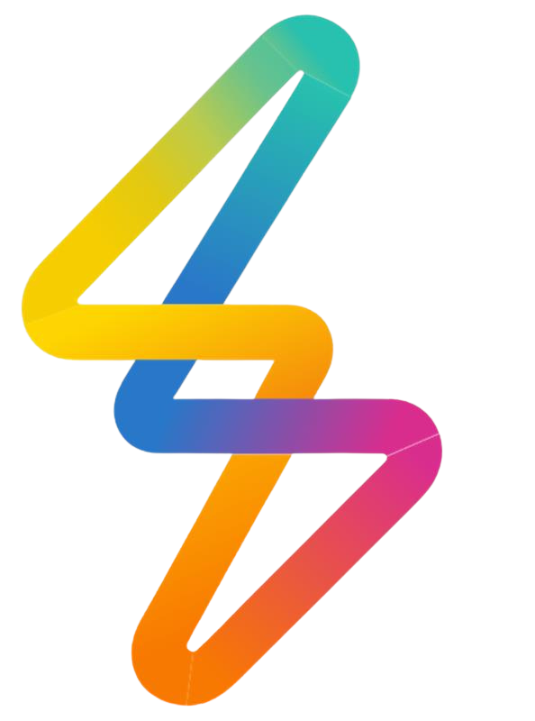
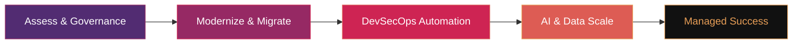

<h1>Devopstrio</h1>

<strong>Enterprise Cloud · AI · DevOps Acceleration</strong>

 

> **Building the future of enterprise infrastructure — one blueprint at a time.**
> 
> 18 open-source accelerators &nbsp;·&nbsp; 5 technology domains &nbsp;·&nbsp; 3 cloud providers &nbsp;·&nbsp; 100% production-grade

---

### 📄 Company Profile

> Download our full company profile to learn about our services, methodologies, technology stack, and engagement models.

---

## 🏠 Our Website

**[devopstrio.co.uk](https://devopstrio.co.uk/)** — Explore our full portfolio of enterprise cloud, AI, and DevOps solutions.

| Page | Link |
| :--- | :--- |
| 🏠 **Homepage** | [devopstrio.co.uk](https://devopstrio.co.uk/) |
| ⚙️ **Services** | [devopstrio.co.uk/#services](https://devopstrio.co.uk/#services) |
| 📦 **Repositories** | [devopstrio.co.uk/#repos](https://devopstrio.co.uk/#repos) |
| 📊 **Stats** | [devopstrio.co.uk/#stats](https://devopstrio.co.uk/#stats) |
| 📋 **Catalog** | [devopstrio.co.uk/#catalog](https://devopstrio.co.uk/#catalog) |
| 📬 **Contact** | [devopstrio.co.uk/#contact](https://devopstrio.co.uk/#contact) |

---

## 🏗️ Our Transformation Methodology

---

## ⚙️ Our Services

<table>
<tr>
<td width="50%">

### ☁️ Enterprise Landing Zone
CAF-aligned multi-cloud governance foundations with policy-as-code and subscription vending.

- Multi-tenant Governance
- Network Segmentation
- Identity Integration

[**Explore →**](https://devopstrio.co.uk/#services)

</td>
<td width="50%">

### 🤖 AI Landing Zone ⭐ Top Choice
GenAI-ready secure OpenAI, Bedrock & Vertex AI deployment with enterprise RAG pipelines.

- Enterprise RAG Ready
- AI Governance & Safety
- Scalable LLM Pipelines

[**Explore →**](https://devopstrio.co.uk/#services)

</td>
</tr>
<tr>
<td width="50%">

### 📊 Data Landing Zone
Lakehouse architectures with Microsoft Fabric, Databricks & Snowflake for real-time analytics.

- Real-time Analytics
- Data Mesh Patterns
- Automated Governance

[**Explore →**](https://devopstrio.co.uk/#services)

</td>
<td width="50%">

### 🔐 Security & Compliance
Zero Trust architecture, IAM blueprints & Defender suite automation aligned to CIS and NIST.

- Zero Trust Model
- Compliance Automation
- DevSecOps Pipelines

[**Explore →**](https://devopstrio.co.uk/#services)

</td>
</tr>
</table>

---

## ☁️ Multicloud Excellence

| Platform | Specialization |
| :--- | :--- |
| 🟦 **Azure** | Enterprise Landing Zones (ALZ), AKS Hub-Spoke, Microsoft Fabric Foundations |
| 🟧 **AWS** | Control Tower customization, EKS Blueprints, Serverless architectures |
| 🟩 **GCP** | Anthos modernization and secure GKE foundations |

---

## 🛠️ Flagship Open-Source Repositories

| Domain | Repository | Value |
| :--- | :--- | :--- |
| **Strategy** | [devopstrio-landing-zone](https://github.com/Devopstrio/devopstrio-landing-zone) | Multi-cloud governance blueprint |
| **Networking** | [terraform-enterprise-networking](https://github.com/Devopstrio/terraform-enterprise-networking) | Hub-and-spoke with centralized security |
| **AI** | [azure-openai-secure-reference](https://github.com/Devopstrio/azure-openai-secure-reference) | Privacy-first LLM infrastructure |
| **Kubernetes** | [aks-production-foundation](https://github.com/Devopstrio/aks-production-foundation) | Production-ready AKS orchestration |
| **FinOps** | [cloud-finops-dashboard](https://github.com/Devopstrio/cloud-finops-dashboard) | Automated cloud cost transparency |
| **Security** | [security-baselines](https://github.com/Devopstrio/security-baselines) | CIS & NIST-aligned remediation |
| **Data** | [data-lakehouse-blueprint](https://github.com/Devopstrio/data-lakehouse-blueprint) | Medallion architecture on Fabric & Databricks |

---

## 📫 Connect With Us

| | |
|:---:|:---:|
| 🌐 **Website** | [devopstrio.co.uk](https://devopstrio.co.uk/) |
| 📄 **Company Profile** | [Download PDF](../assets/COMPANY_PROFILE.pdf) |
| 💼 **LinkedIn** | [linkedin.com/company/devopstrioglobal](https://www.linkedin.com/company/devopstrioglobal/) |
| 📧 **Email** | [info@devopstrioglobal.com](mailto:info@devopstrioglobal.com) |

 

 

⭐ **Follow Devopstrio** to stay updated on our latest open-source accelerators and enterprise blueprints.

